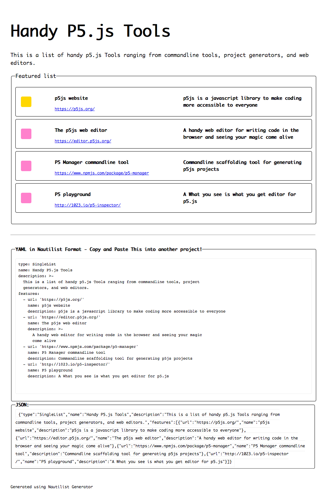
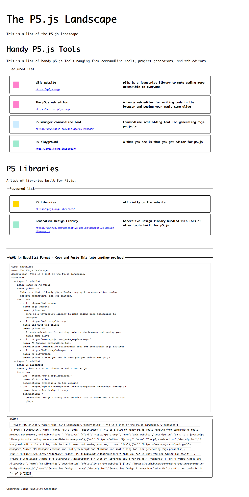

# Nautilist-generator: Examples
> Example of running `nautilist-generator generate <ymlFile>` 

## SingleList: `/singlelist`
> Generate a static HTML file of your list `/your-list-name/index.html`

```sh
nautilist-generator generate my-p5-tools.yaml
```


## MultiList: `/multilist`
> Generate a static HTML file with your list of lists: `/your-list-name/index.html`

```sh
nautilist-generator generate my-p5-landscape.yaml
```

## Example Images

### Single List Example



### Single List Example

